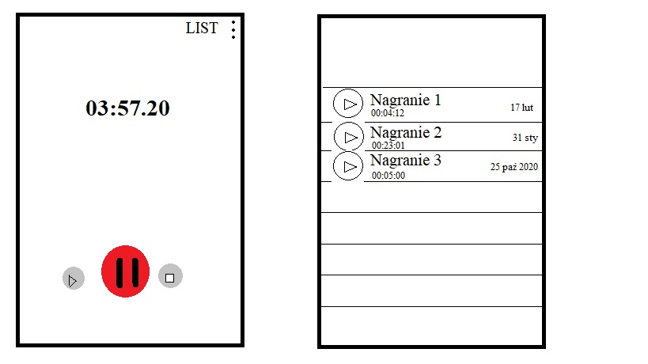

# Why this app?
I am a junior developer who graduated course Android Basics Nanodegree by Google 
(see https://confirm.udacity.com/HHALAPSN). After the course I realized that the main skill I need 
to still develop is programming apps, resolving real problems myself. So this app is my way to 
achieve this. I want to build something useful. My goal is to learn how to build a modern android 
app with architecture standards, and how to put this app in Google Play Store, maintain it in long 
term, and take care of users. If You want to help me to improve this app or showing me better 
problem solving I'm open to learning something from a smarter developer. I'll be very grateful for 
Your help.

### App concept
This is my concept of an app I want to create. My goal is to create an app with a minimum number 
of features but also an app that can put in Google Play Store. 

The main feature is to record audio on demand. In the main activity, the user can see a big rec 
button. When it clicked recording starts. I want to add some animations for this and for example 
when the user clicks the rec button its changes the color from red to gray with a pause icon inside. 
Also, additional buttons appear (play and pause - smaller than rec button - that shows with some 
animation). 

REC BUTTON - When the user clicked it recording starts (or shows an alert about permissions). Then 
rec button changes color to gray with a pause icon inside, and in addition, two buttons show up - play 
and stop. Also when the user starts recording the timer show recording time (mm:ss.ms format) and a 
little red dot next to the timer alternately shows up and disappears throughout the recording. 

PAUSE BUTTON - Pause recording, pause button icon change to rec icon again. User can press the rec 
button again and continue recording. 

STOP BUTTON - Stops recording and show a dialog with saving options. 

PLAY BUTTON - Plays actual recording from start

In main activity in options menu user can go to the list of recordings. This moves the user to 
list of all recordings in another activity/fragment. Particular record has title, length, date of 
record, and some icon that shows there is a play record possibility. Of course to play a particular 
recording the user can tap it. Long press activate possibility of mark particular recordings (or 
all of them) and share or delete. 

This is minimum features I thing app must have. I add some concept images.

